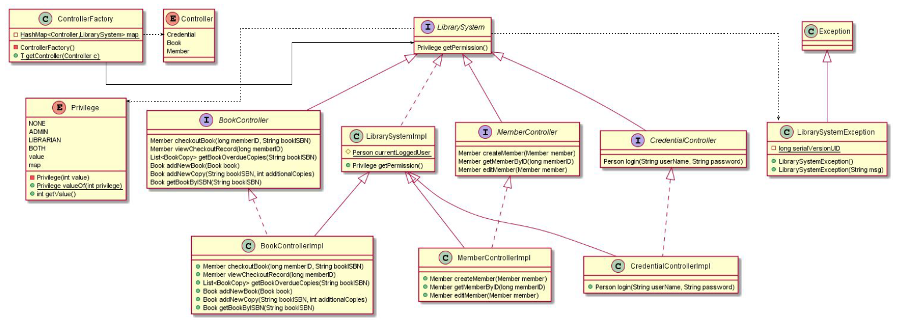

## librarySystem
A library management system (**this project is not for commercial usage or any usage at all, you may view it, but you can't use it**).

## Controllers Class Diagram

The reset of the diagrams (class diagrams. sequence diagrams and use cases) are in the diagrams folder.

## Features
1. Hibernate is used to manage the backend.
2. Used double layer security (Frontend and Backend).
3. Used generic factory function.
